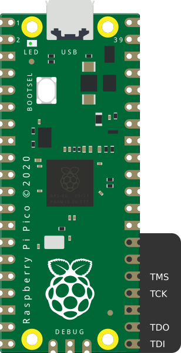

## pico-xvc

This project implements a Raspberry Pico based Xilinx Virtual Cable (XVC). It
allows using Raspberry Pico as a JTAG adapter for programming Xilinx FPGAs.

It is derived from the excellent [pico-dirtyJtag](https://github.com/phdussud/pico-dirtyJtag/) project.

A special shoutout goes to https://github.com/tom01h for crazily improving the
performance of this project - thank you!

The pinout is as follows (it maches the pin names of the target device's JTAG port, in other word - you DON'T need to swap TDI and TDO pins like you would do with the interfaces like SPI or UART):

| Pin name | GPIO   |
|:---------|:-------|
| TDI      | GPIO21 |
| TDO      | GPIO20 |
| TCK      | GPIO19 |
| TMS      | GPIO18 |
| GND      | Pin 23 |

Note: The Raspberry Pico is a 3.3v device. Ensure that the target device and
the Pico are electrically compatible before connecting them.




### Compatibility tests

The project has been verified to be working with the following hardware and software combinations:


| Programmer Board    | Firmware      | Target                                  | Software                    | Date        |
|---------------------|---------------|-----------------------------------------|-----------------------------|-------------|
| Raspberry Pi Pico   | xvc-pico      | EBAZ4205 'Development' FPGA Board       | Vivado 2021.1               | August 2021 |
| Raspberry Pi Pico   | xvc-pico      | EBAZ4205 'Development' FPGA Board       | Vivado ML Standard 2023.1   | May 2023    |
| Raspberry Pi Pico W | xvc-pico-wifi | Unknown                                 | Vivado v2023.1 (64-bit)     | April 2024  |
| Raspberry Pi Pico   | xvc-pico      | Coolrunner II XC2C64A (Matrix Glitcher) | Xilinx ISE 14.7 (Linux x64) | August 2024 |


### Building pico-xvc (for Linux users)

Shortcut: Upload the pre-built `xvcPico.uf2` file to the Raspberry Pico
Board. Done - skip to the next section.

Install dependencies:

```
sudo apt install cmake gcc-arm-none-eabi libnewlib-arm-none-eabi \
  libstdc++-arm-none-eabi-newlib git libusb-1.0-0-dev build-essential \
  make g++ gcc
```

```
mkdir ~/repos
cd ~/repos

git clone https://github.com/raspberrypi/pico-sdk.git
cd pico-sdk; git submodule update --init

cd ~/repos
git clone https://github.com/kholia/xvc-pico.git
```

Build the host-side daemon:

```
cd ~/repos/xvc-pico/daemon
cmake .
make
sudo ./xvcd-pico  # run on the host computer, turn on the pico board before
```

Build the Raspberry Pico's firmware:

```
cd ~/repos/xvc-pico/firmware
export PICO_SDK_PATH=${HOME}/repos/pico-sdk
cmake .
make -j4
```

### Windows Notes

Grab `xvcd-pico.exe` from the `builds` folder of this repository itself.

You need to install the `libusbK` driver with `Zadig` (https://zadig.akeo.ie/).

OR

You can install the WinLibUSB driver from `USB Drive Tool Application`
(https://visualgdb.com/UsbDriverTool/).

Credit goes to https://github.com/benitoss/ for these instructions.


### Usage

On the host computer with the Raspberry Pi Pico connected, run the XVC Daemon
Server.

```
./xvcd-pico
```

In Vivado, select the `Add Xilinx Virtual Cable (XVC)` option in the `Hardware
Manager` and mention the `IP address` and the `Port` of the host computer.


### Tips

If you see the `End of startup status: LOW` error message in Vivado, check the
FPGA power supply's voltage and current ratings.

I found `Maker Pi Pico Base` really helpful for debugging GPIO stuff.

[This URL](https://github.com/aws/aws-fpga/blob/master/hdk/docs/Virtual_JTAG_XVC.md)
says that Xilinx Virtual Cable (XVC) protocol allows (local or remote) Vivado
to connect to a target FPGA for debug leveraging standard Xilinx standard debug
cores like Integrated Logic Analyzer - ILA, Virtual Input/Output - VIO, and
others. `ILA` works fine over our Raspberry Pico JTAG adapter. Vitis stuff is
also supported.


### Rough Performance Stats ("Speed")

If cost and ease-of-availability are the driving constraints (at the cost of
speed), then this project is 'usable' and can probably suffice. If higher
programming speed is a requirement, I recommend using `xc3sprog` or
`openFPGALoader` with an FT2232H board.

This project might be one of the cheapest, most energy-efficient `Vivado-Compatible`
JTAG programmers. I use this project as my "daily driver" now ;)

Writing `ebaz4205_top.bit (371.6 KiB)` takes only ~2.5 seconds now - thanks to
tom01h. Don't `overestimate` the speed of human programmers and Vivado though
;)

```
$ time ./openFPGALoader -c xvc-client --port 2542 --file-type bin ebaz4205_top.bin
empty
detected xvcServer version v1.0 packet size 12288
freq 6000000 166.666667 166 0
a6 0 0 0
Open file DONE
Parse file DONE
load program
Load SRAM: [==================================================] 100.00%
Done
./openFPGALoader -c xvc-client --port 2542 --file-type bin ebaz4205_top.bin  0.00s user 0.01s system 0% cpu 7.389 total
```

It seems `openFPGALoader` is a lot slower than Vivado in programming devices
via `XVC`!?

Writing `corescore_0.bit (2 MiB)` which uses ~100% FPGA LEs takes around ~9
seconds.


### Flash FPGA without Vivado

```
./openFPGALoader -c xvc-client --port 2542 --file-type bin ebaz4205_top.bin
```


### USB UARTs

Connect Pico's hardware UART pins to FPGA's UART.

```
#define UART_TX_PIN 0
#define UART_RX_PIN 1
```

Set UART of FPGA to 115200 baud rate.

Note: /dev/ttyACM(n) will appear when Pico's USB is connected.


### Related Ideas / Projects

- https://github.com/kholia/xvcpi
- https://github.com/kholia/xvc-esp32
- https://github.com/kholia/xvc-esp8266
- https://github.com/phdussud/pico-dirtyJtag/
- https://github.com/kholia/Colorlight-5A-75B
- https://github.com/fusesoc/blinky#ebaz4205-development-board
